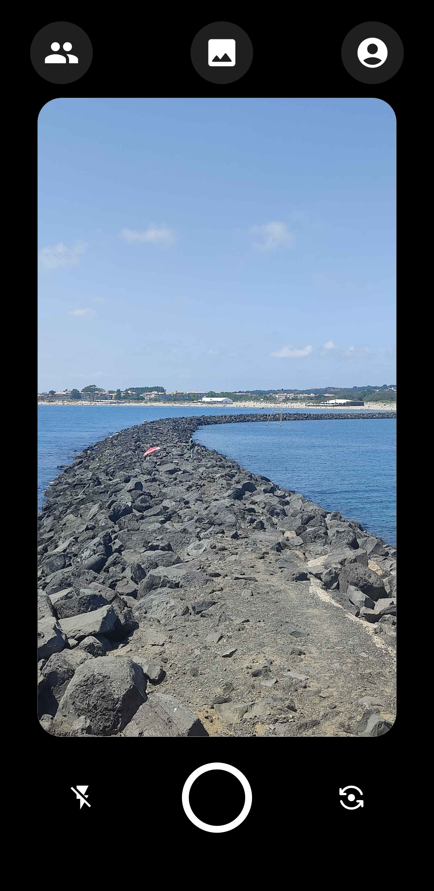
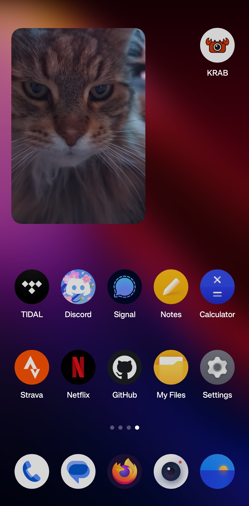

<div align="center">


# KRAB

An Android app to share photos with friends, visible on your home screen.

<div style="display: flex; justify-content: center; gap: 10px;">
  
  
</div>
</div>

## About

KRAB is an Android app that lets you share photos with your friends using home screen widgets. Originally developed as a privacy-friendly alternative to the [Locket Widget App](https://play.google.com/store/apps/details?id=com.locket.Locket&hl=en-US).

This is a small, quite barebones personal project. I am not an app developer and the backend might not be perfect, but it still is functional. Feel free to contribute to the project!

## Features

- Create or join a group with your friends.
- Take pictures and optionally add a caption.
- Share the photo with your friends in the group.
- The photo will be displayed in the widget on your home screen!

## Getting Started
### Prerequisites
- Install [Flutter](https://flutter.dev/docs/get-started/install).
- Set up a [Supabase](https://supabase.com) project and get the API URL and key..
- Set up a [Firebase](https://firebase.google.com) project and get the `google-services.json` file.

### Installation
- Clone the repository:
  ```bash
  git clone https://github.com/zatomos/KRAB.git
  ```
  
- Install the dependencies:
  ```bash
  flutter pub get
  ```
  
- Create a `.env` file in the root directory and add the following:
  ```bash
  SUPABASE_URL=your-supabase-url
  SUPABASE_ANON_KEY=your-anon-key
  ```

- Setup the Supabase database using the files provided under the `supabase` directory.
- Run the app:
  ```bash
  flutter run
  ```