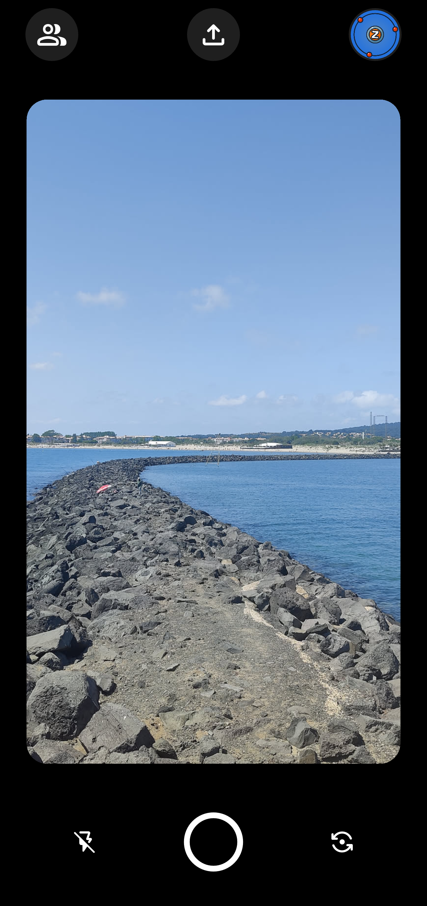
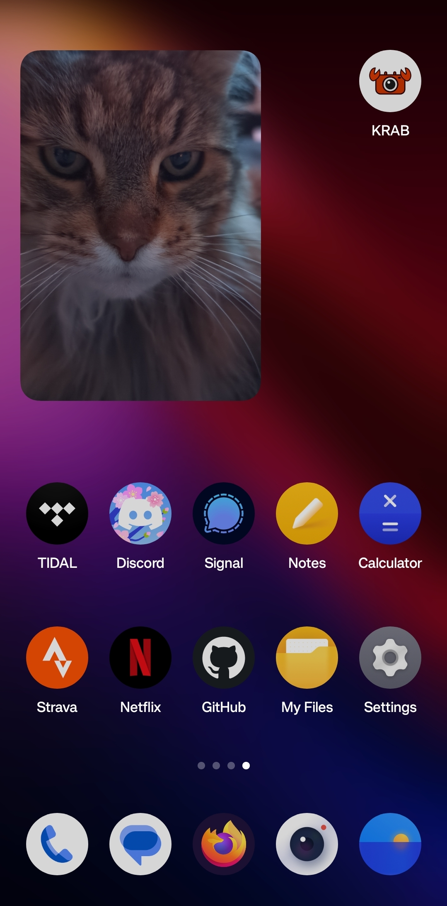
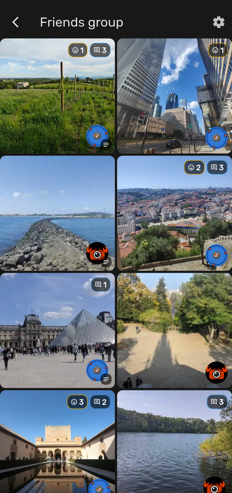
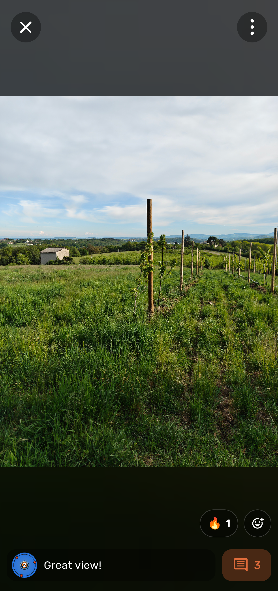

<div align="center">
<br />
</div>

<h1 align="center">KRAB</h1>

<br />

<h4 align="center">KRAB is an Android app for quickly sharing photos within groups of friends.
Photos shared to a group appear directly on every member's home screen.</h4>

<div align="center">
  <a href="https://flutter.dev/">
    
  </a>
  <a href="https://dart.dev/">
    
  </a>
  <a href="https://supabase.com/">
    
  </a>
  <br />
  
  <a href="LICENSE">
    
  </a>
</div>

<br />

<div align="center" style="display: flex; justify-content: center; gap: 10px;">
  
  
<br />
  
  
</div>

<p align="center"><i>Originally developed as a privacy-friendly alternative to the <a href="https://play.google.com/store/apps/details?id=com.locket.Locket&hl=en-US">Locket Widget App</a>.</i></p>

## ✨ Features

- 🔄 Sharing:
  - Snap a photo to one or more groups and optionally add a caption.
  - A notification is sent to every member of the group.
  - Photos appear instantly on every group member's home screen via a widget.
  - Users can choose to display the most recent or the three most recent images they received.

- 🌐 Social:
  - Create or join groups with friends using an invite system.
  - Comment on photos and reply to comments.

- 🛡️ Privacy:
  - Fully self-hostable backend.
  - Even though the app uses FCM to send push notifications, their content is fully hidden from
    Google.

## 🏗️ Architecture

The backend uses a [Supabase](https://supabase.com/) instance. It authenticates users, stores the
photos, keeps track of who belongs to which group, and sends notifications when something new is
posted.

- The app talks to Supabase directly for all reads and writes. Access rules make sure each user only
  sees content from the groups they belong to.
- When a photo or comment is posted, the database automatically triggers a function that pushes a
  notification (via Firebase) to the other group members, whose apps then refresh their widget.

---

## 🚀 Setup

### 1. Firebase setup

1. Go to the [Firebase console](https://console.firebase.google.com) and **create a project**.
2. **Add an Android app** to the project:
   - Package name: **`fr.zatomos.krab`** (or your own, if you change `applicationId` in
     `android/app/build.gradle`).
   - Download the generated **`google-services.json`**.
3. **Enable Cloud Messaging**: in the console, *Settings / General / Cloud Messaging*
     (the *Firebase Cloud Messaging API (V1)* must be enabled).
4. **Create a service-account key** (used by the backend to send notifications):
   - *Settings / Service accounts / Generate new private key*.
   - This downloads a JSON file. Keep it secret, you'll paste its contents into the backend setup
     in the next step.

> The `google-services.json` is safe to ship in the app. The **service-account key is a secret**,
> never commit it.

### 2. Backend setup: Supabase

You can use a free or paid hosted instance at https://supabase.com, which has a reasonable
[privacy policy](https://supabase.com/privacy). If you'd rather self-host your own instance, you can
do so by running the included scripts.
> See the [Supabase self-hosting guide](https://supabase.com/docs/guides/self-hosting) to learn more.

**Prerequisites:** a Linux server with [Docker](https://docs.docker.com/engine/install/) and the
Docker Compose plugin.

Run the backend setup script `setup_backend.sh` on the server. It installs self-hosted Supabase
(if missing), configures it for KRAB, loads the database schema, creates the storage buckets,
and deploys the notification edge functions:

```bash
curl -fsSL https://raw.githubusercontent.com/zatomos/KRAB/main/scripts/setup_backend.sh | bash
```

It will ask you for:
- **API URL** clients use.
- **Studio dashboard** username / password.
- The **Firebase service-account JSON** from step 1.

When it finishes, grab the **anon key** for the app:

```bash
grep '^ANON_KEY=' ~/supabase-project/.env
```

You'll also want to put your API URL behind HTTPS for production use.

### 3. App setup: Flutter

**Prerequisites:** [Flutter](https://flutter.dev/docs/get-started/install).

1. Clone and install dependencies:
   ```bash
   git clone https://github.com/zatomos/KRAB.git
   cd KRAB
   flutter pub get
   ```
2. Add your Firebase config to the app. The easiest way is the FlutterFire CLI, which generates both
   files for your project:
   ```bash
   dart pub global activate flutterfire_cli
   flutterfire configure
   ```
   This creates `lib/firebase_options.dart` and `android/app/google-services.json`.
3. Create your `.env` from the template and fill it in:
   ```bash
   cp .env.example .env
   ```
   ```ini
   SUPABASE_URL='https://your-supabase-url'      # the API URL from step 2
   SUPABASE_ANON_KEY='your_anon_key'             # the ANON_KEY from step 2

   # Optional: password reset
   PASSWORD_RESET_URL='https://your-domain/reset-password.html'

   # Optional: auto-updates
   MANIFEST_URL='YOUR_MANIFEST_URL'
   ENABLE_AUTO_UPDATE='false'
   ```
4. Run it:
   ```bash
   flutter run
   ```

### 4. Password reset (optional)

Password reset sends an email with a link to a small web page where the user sets a new password.
It needs a publicly reachable page and an SMTP server to send the email.

1. Pick a public hostname for the reset page (e.g. `https://krab.example.com`) and point it
   (via DNS / your reverse proxy) at the server.
2. **Get an SMTP app password.** Use an *app-specific password* from your email provider, **not**
   your account password.
3. Run the setup script on the server:
   ```bash
   curl -fsSL https://raw.githubusercontent.com/zatomos/KRAB/main/scripts/reset_password/setup-reset-pwd-page.sh | sudo bash
   ```
   It asks for your Supabase URL, the public page URL, the anon key, the LAN IP the auth container uses to fetch the email template, and your **SMTP host / port / user / password**. It then serves the page, whitelists the redirect, installs the branded email template, and configures SMTP.
4. Set `PASSWORD_RESET_URL` in the app's `.env` to the page URL.

### 5. Auto-update the app (optional)

The app can check a manifest and prompt users to update. Host a `manifest.json` (template: `manifest.json.example`) listing your releases and their APK download URLs, then set `MANIFEST_URL` and `ENABLE_AUTO_UPDATE='true'` in the app `.env`.

A helper to publish APKs + manifest to a Nextcloud instance is provided (`scripts/release.sh`).

---

## 📄 License

KRAB is licensed under the [GNU General Public License v3.0](LICENSE).
