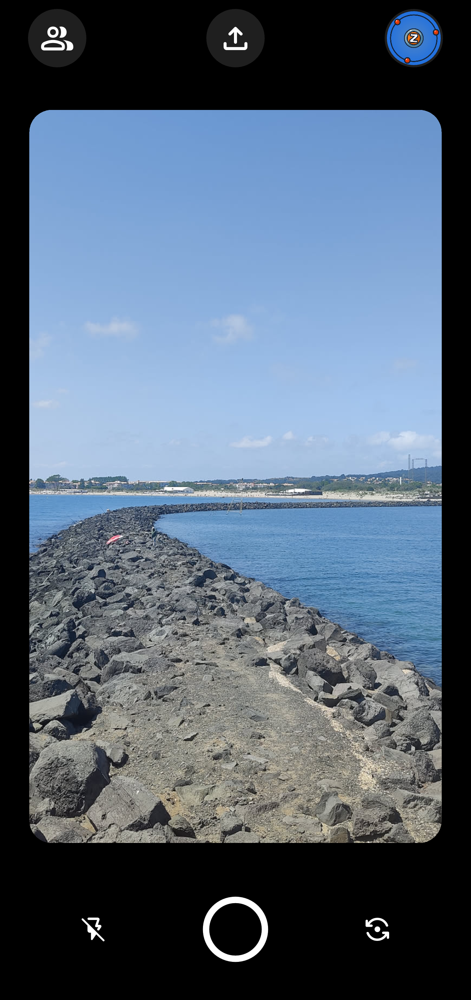
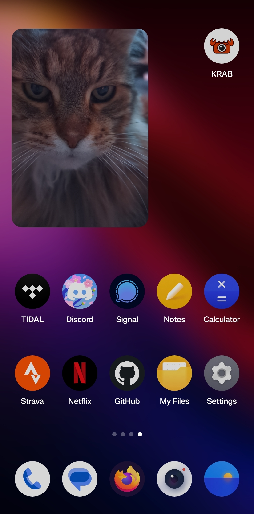
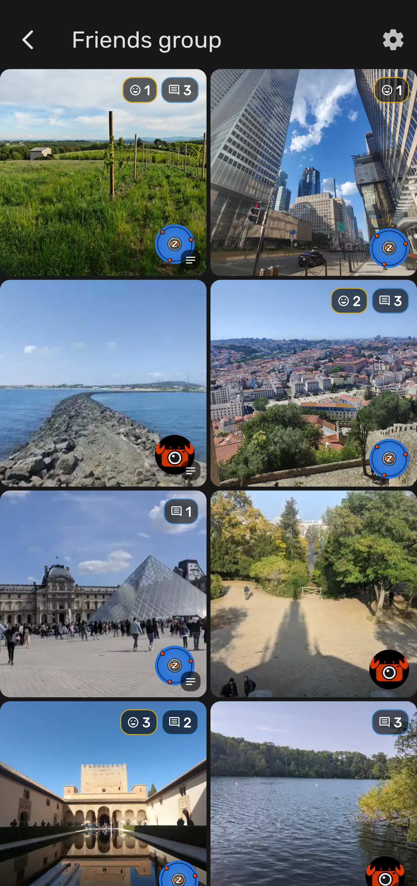
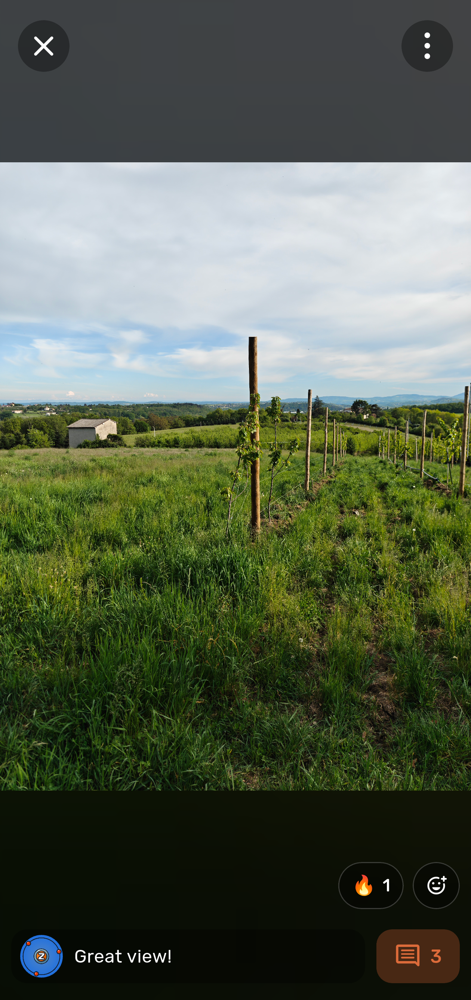

<div align="center">
<br />
</div>

<h1 align="center">KRAB</h1>

<br />

<h4 align="center">KRAB is an Android app for quickly sharing photos within groups of friends.
Photos shared to a group appear directly on every member's home screen.</h4>

<div align="center">
  <a href="https://flutter.dev/">
    
  </a>
  <a href="https://dart.dev/">
    
  </a>
  <a href="https://supabase.com/">
    
  </a>
  <br />
  
  <a href="LICENSE">
    
  </a>
</div>

<br />

<div align="center" style="display: flex; justify-content: center; gap: 10px;">
  
  
<br />
  
  
</div>

<p align="center"><i>Originally developed as a privacy-friendly alternative to the <a href="https://play.google.com/store/apps/details?id=com.locket.Locket&hl=en-US">Locket Widget App</a>.</i></p>

## ✨ Features

- 🔄 Sharing:
  - Snap a photo to one or more groups and optionally add a caption.
  - A notification is sent to every member of the group.
  - Photos appear instantly on every group member's home screen widget.
  - Users can choose to display the most recent or the three most recent images they received.

- 🌐 Social:
  - Create or join groups with friends using an invite system.
  - Comment on photos and reply to comments.
  - React to photos with emojis.

- ️🏘 Multi-instance:
  - Connect to as many KRAB instances as you like, each with its own account.
  - Send photos to groups on several instances at once.
  - Feeds, notifications and the widget merge every instance's photos into one timeline.

- 🛡️ Privacy:
  - Fully self-hostable backend.
  - Even though the app uses FCM to send push notifications, their content is hidden from Google.

## 🏗️ Architecture

The backend uses a [Supabase](https://supabase.com/) instance. It authenticates users, stores the
photos, keeps track of who belongs to which group, and sends notifications when something new is
posted.

- The app talks to Supabase directly for all reads and writes. Access rules make sure each user only
  sees content from the groups they belong to.
- When a photo or comment is posted, the database automatically triggers a function that pushes a
  notification to the other group members, whose apps then refresh their widget.
- The app can hold several instances at once. Each has its own session, caches and push
  registration, and instances never talk to each other.

---

## 🚀 Setup

### 1. Firebase Cloud Messaging (push)

Notifications use your own Firebase project.

1. At the [Firebase console](https://console.firebase.google.com), create a project. You can
   leave the other Firebase products disabled, this project only needs Cloud Messaging.
2. Add an Android app whose package matches the APK you distribute (e.g. `fr.zatomos.krab` for the
   stock build, or your own `applicationId`) and download its **`google-services.json`**.
   This holds the app's public config.
3. Go to Project settings > **Service accounts > Generate new private key** and download the
   **service-account JSON**.

### 2. Backend setup: Supabase

The project includes scripts to automatically set up a self-hosted Supabase instance.
> See the [Supabase self-hosting guide](https://supabase.com/docs/guides/self-hosting) to learn more.

**Prerequisites:** a Linux server with [Docker](https://docs.docker.com/engine/install/) and the
Docker Compose plugin.

#### Running the script

Copy the `google-services.json` and the service-account JSON to your server.

Run the backend setup script `setup_backend.sh` on the server. It installs a self-hosted Supabase
instance (if missing), configures it for KRAB, loads the database schema, creates the storage
buckets,  stores your Firebase config, and deploys the edge functions.

```bash
curl -fsSL https://raw.githubusercontent.com/zatomos/KRAB/main/scripts/setup_backend.sh | bash
```

It will ask you for:
- **Supabase project** location (defaults to `~/supabase-project`).
- **API URL** clients use.
- The **address the API gateway listens on** (see the warning below).
- **Studio dashboard** username / password.
- Whether to keep the **database and photos** in the project directory, or put them somewhere else.
- The **path to `google-services.json`** and the **path to the service-account JSON**.

When it finishes, it prints a **connection token**, a single string that packs the API URL and the
anon key. That is all a user needs to point the app at your instance; share it with the people you're
inviting.

You should be able to access the **Supabase Studio dashboard**, by default on port `8000`.
Log in with the Studio username / password you set during setup.

You'll also want to put your API URL behind HTTPS for production use.

> [!WARNING]
> **The dashboard lives at the same address as the API.** Both are served by the same gateway on
> port `8000`, so whatever you do to make the API reachable publishes Studio too, behind nothing
> but the username and password above.
>
> When you expose your instance, either:
> - **restrict the dashboard**: let `/auth/v1`, `/rest/v1`, `/storage/v1`, `/realtime/v1` and
>   `/functions/v1` through publicly and require your own authentication on every other path, or
> - **don't publish it at all**: expose only those five paths, and reach Studio through an SSH
>   tunnel when you need it.
>
> Either way, set a secure Studio password, and mind the address the setup script asks for.

#### Outgoing email (optional)

Needed for password reset or email verification below. **Use an app-specific password** from
your provider, not your account password.

```bash
curl -fsSL https://raw.githubusercontent.com/zatomos/KRAB/main/scripts/setup_smtp.sh | bash
```

It asks for your SMTP details, sender address and name.

#### Password reset (optional)

Password reset emails a link to a page where the user sets a new password. Requires SMTP.

```bash
curl -fsSL https://raw.githubusercontent.com/zatomos/KRAB/main/scripts/setup_password_reset.sh | bash
```

#### Email verification (optional)

When enabled, signing up sends a confirmation email and the account can't log in until the link
is clicked. Requires SMTP.

```bash
curl -fsSL https://raw.githubusercontent.com/zatomos/KRAB/main/scripts/setup_email_confirmation.sh | bash
```

To turn it back off, re-run the script with `--off`.

---

### 3. Building the app (optional)

**Prerequisites:** [Flutter](https://flutter.dev/docs/get-started/install).

1. Clone and install dependencies:
   ```bash
   git clone https://github.com/zatomos/KRAB.git
   cd KRAB
   flutter pub get
   ```
2. Create your build config:
   ```bash
   cp lib/config.example.dart lib/config.dart
   ```
3. Run it:
   ```bash
   flutter run
   ```

#### Release signing

Only needed if you publish APKs. Without a keystore, release builds fall back to Android's **debug**
key.

1. Generate the keystore, once:
   ```bash
   keytool -genkey -v -keystore ~/krab-release.jks \
     -keyalg RSA -keysize 4096 -validity 10000 -alias krab
   ```
2. Point the build at it:
   ```bash
   cp android/key.properties.example android/key.properties
   # then fill in storeFile / storePassword / keyAlias / keyPassword
   ```
3. Build, and confirm it is signed with your key rather than the debug key:
   ```bash
   flutter build apk --release
   apksigner verify --print-certs build/app/outputs/flutter-apk/app-release.apk
   ```

#### Auto-update

The app can check for new versions from GitHub and prompt users to update.

Enable it in **`lib/config.dart`**, pointing it at your own repository:

```dart
const updateRepo = 'zatomos/KRAB';
const enableAutoUpdate = true;
```

Use `scripts/release.sh` to build, verify and publish a release:

```bash
scripts/release.sh "Added a thing" "Fixed another"
```

Requires the [`gh` CLI](https://cli.github.com).

## 📄 License

KRAB is licensed under the [GNU General Public License v3.0](LICENSE).
